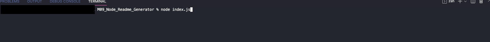
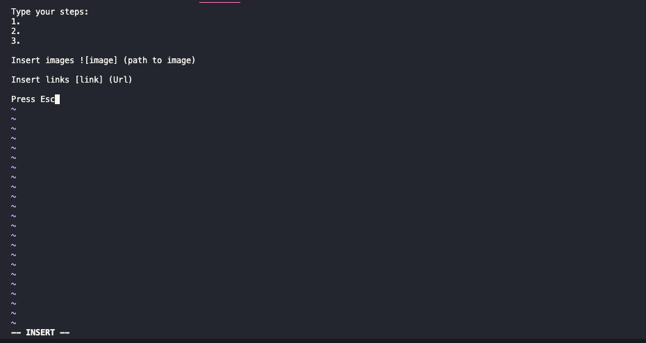
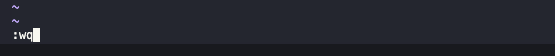
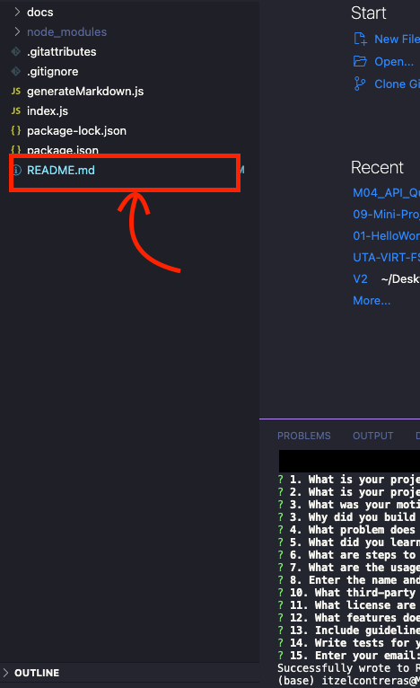
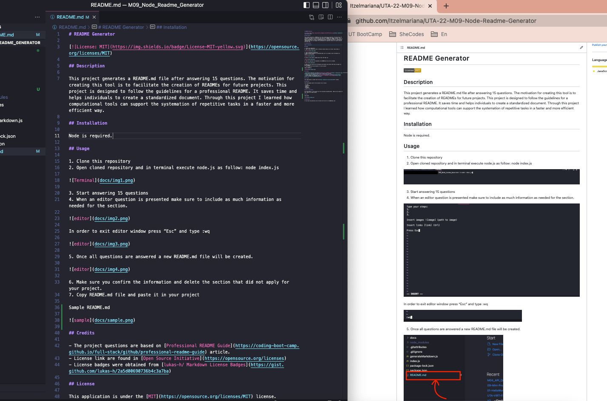
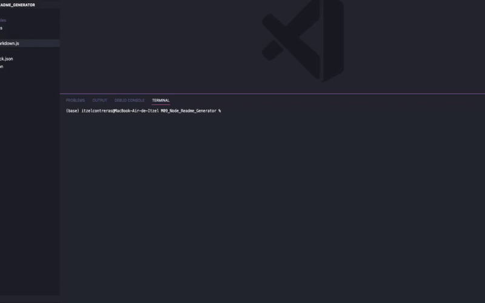

# README Generator

## Description

This project generates a README.md file after answering 15 questions. The motivation for creating this tool is to facilitate the creation of READMEs for future projects. This project is designed to follow the guidelines for a professional README. It saves time and helps individuals to create a standardized document. Through this project I learned how computational tools can support the systemation of repetitive tasks in a faster and more efficient way.

## Installation

Node is required.

## Usage

1. Clone this repository
2. Open cloned repository and in terminal execute node.js as follow: node index.js

3. Start answering 15 questions
4. When an editor question is presented make sure to include as much information as needed for the section.

In order to exit editor window press “Esc” and type :wq

5. Once all questions are answered a new README.md file will be created.

6. Make sure you confirm the information and delete the section that did not apply for your project.
7. Copy README.md file and paste it in your project

Sample README.md

## Credits

- The project questions are based on [Professional README Guide](https://coding-boot-camp.github.io/full-stack/github/professional-readme-guide) article.
- License link are found in [Open Source Initiative](https://opensource.org/licenses)
- License badges were obtained from [lukas-h/ ​​Markdown License Badges](https://gist.github.com/lukas-h/2a5d00690736b4c3a7ba)

## License

This application is under the [MIT](https://opensource.org/licenses/MIT) license.

## Features

The technologies used in this project are as follow:

- VS Code
- JavaScript
- Node.js
- Markdown
- Inquirer.js

## How to Contribute

Any improvements in the project are very welcome and appreciated . Make sure you email me your ideas at my email below.

## Test

[Video demo](https://watch.screencastify.com/v/TPValF19DkB0pbQPKfhk)

## Questions

If you have any questions you can reach out to me at email@me.com
